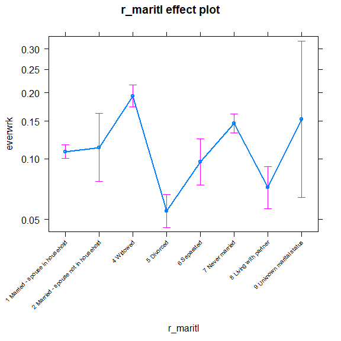

Logistic Regression Excercise
================
Afif
February 3, 2019

------------------------------------------------------------------------

Problem Statement
-----------------

Use the NH11 data set that we loaded earlier.

1.  Use glm to conduct a logistic regression to predict ever worked (everwrk) using age (age\_p) and marital status (r\_maritl).
2.  Predict the probability of working for each level of marital status.

Note that the data is not perfectly clean and ready to be modeled. You will need to clean up at least some of the variables before fitting the model.

------------------------------------------------------------------------

Solution
--------

First is to load the data, and check the summary the three necessary variables : ever worked (everwrk), age (age\_p), and marital status (r\_maritl).

``` r
NH11 <- readRDS("NatHealth2011.rds")
NH11.small <- data.frame(everwrk=NH11$everwrk, age_p=NH11$age_p,r_maritl=NH11$r_maritl)
summary(NH11.small)
```

    ##               everwrk          age_p      
    ##  1 Yes            :12153   Min.   :18.00  
    ##  2 No             : 1887   1st Qu.:33.00  
    ##  7 Refused        :   17   Median :47.00  
    ##  8 Not ascertained:    0   Mean   :48.11  
    ##  9 Don't know     :    8   3rd Qu.:62.00  
    ##  NA's             :18949   Max.   :85.00  
    ##                                           
    ##                             r_maritl    
    ##  1 Married - spouse in household:13943  
    ##  7 Never married                : 7763  
    ##  5 Divorced                     : 4511  
    ##  4 Widowed                      : 3069  
    ##  8 Living with partner          : 2002  
    ##  6 Separated                    : 1121  
    ##  (Other)                        :  605

From the summary result above, the dependent variables everwrk has quite a lot of missing datas, and quite a few of unnecessary levels : Refused, Uncertain, and Don't Know. Next step will be to filter out all missing and unnecessary data.

``` r
#Filter out all levels other than the necessary ones = "1 Yes" and "2 No"
NH11.small$everwrk <- factor(NH11.small$everwrk, levels=c("1 Yes","2 No")) 
#Drop unused levels
NH11.small$r_maritl <- droplevels(NH11.small$r_maritl)
#Remove observations with missing data
NH11.small<- NH11.small[!is.na(NH11.small$everwrk), ]
summary(NH11.small)
```

    ##   everwrk          age_p                                  r_maritl   
    ##  1 Yes:12153   Min.   :18.00   1 Married - spouse in household:5458  
    ##  2 No : 1887   1st Qu.:39.00   7 Never married                :2843  
    ##                Median :60.00   4 Widowed                      :2518  
    ##                Mean   :55.98   5 Divorced                     :1907  
    ##                3rd Qu.:73.00   8 Living with partner          : 601  
    ##                Max.   :85.00   6 Separated                    : 467  
    ##                                (Other)                        : 246

Then, to create the logistic regression model using glm model, and examining its summary.

``` r
everwrk.log <- glm(everwrk ~ age_p + r_maritl, data=NH11.small, family="binomial")
summary(everwrk.log)
```

    ## 
    ## Call:
    ## glm(formula = everwrk ~ age_p + r_maritl, family = "binomial", 
    ##     data = NH11.small)
    ## 
    ## Deviance Residuals: 
    ##     Min       1Q   Median       3Q      Max  
    ## -1.0436  -0.5650  -0.4391  -0.3370   2.7308  
    ## 
    ## Coefficients:
    ##                                              Estimate Std. Error z value
    ## (Intercept)                                 -0.440248   0.093538  -4.707
    ## age_p                                       -0.029812   0.001645 -18.118
    ## r_maritl2 Married - spouse not in household  0.049675   0.217310   0.229
    ## r_maritl4 Widowed                            0.683618   0.084335   8.106
    ## r_maritl5 Divorced                          -0.730115   0.111681  -6.538
    ## r_maritl6 Separated                         -0.128091   0.151366  -0.846
    ## r_maritl7 Never married                      0.343611   0.069222   4.964
    ## r_maritl8 Living with partner               -0.443583   0.137770  -3.220
    ## r_maritl9 Unknown marital status             0.395480   0.492967   0.802
    ##                                             Pr(>|z|)    
    ## (Intercept)                                 2.52e-06 ***
    ## age_p                                        < 2e-16 ***
    ## r_maritl2 Married - spouse not in household  0.81919    
    ## r_maritl4 Widowed                           5.23e-16 ***
    ## r_maritl5 Divorced                          6.25e-11 ***
    ## r_maritl6 Separated                          0.39742    
    ## r_maritl7 Never married                     6.91e-07 ***
    ## r_maritl8 Living with partner                0.00128 ** 
    ## r_maritl9 Unknown marital status             0.42241    
    ## ---
    ## Signif. codes:  0 '***' 0.001 '**' 0.01 '*' 0.05 '.' 0.1 ' ' 1
    ## 
    ## (Dispersion parameter for binomial family taken to be 1)
    ## 
    ##     Null deviance: 11082  on 14039  degrees of freedom
    ## Residual deviance: 10309  on 14031  degrees of freedom
    ## AIC: 10327
    ## 
    ## Number of Fisher Scoring iterations: 5

Lastly, is to actually predict the effect of marital status with chance of a person ever working. For this purpose we will examine the result of Effect () function using plot.

``` r
library(effects)
```

    ## Loading required package: carData

    ## lattice theme set by effectsTheme()
    ## See ?effectsTheme for details.

``` r
r_maritl.effect <- Effect("r_maritl", everwrk.log)
plot(r_maritl.effect,axes=list(grid=FALSE, x=list(cex=0.6,rug = FALSE, rotate=45)))
```


